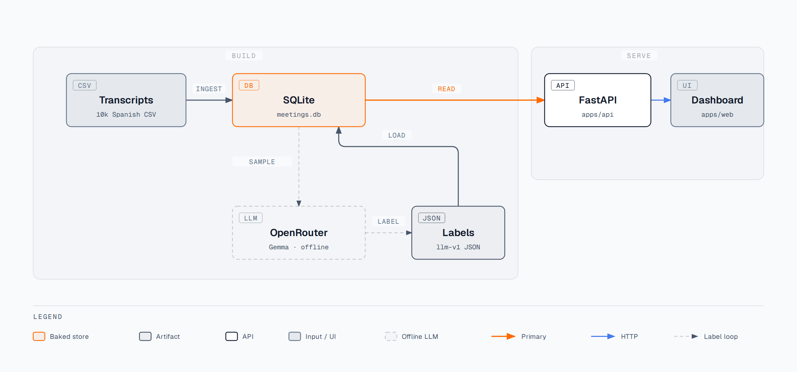

# Arquitectura y decisiones

## Cómo funciona



El labeling corre una sola vez, offline. La app en vivo solo lee un SQLite ya generado — sin API key, sin llamadas a un LLM en cada request.

| Step | Dónde | Qué hace |
|---|---|---|
| **Label** | `scripts/labeling/` | Sample de transcripts en SQLite → OpenRouter (Gemma) → `labels_llm_v2.json` |
| **Build** | `scripts/bake_db.py` | CSV + ese JSON → `data/meetings.db` |
| **Serve** | `apps/api/` + `apps/web/` | API read-only + dashboard en React |

Al clonar el repo, `bake_db.py` corre una sola vez: los labels ya vienen versionados y el script carga el CSV y el JSON en la misma pasada. Las dos pasadas son el loop de autoría — generar la DB para que el labeler tenga qué leer, correr el labeling, y volver a generarla.

## Estructura del repo

```
.
├── main.py              entry point de Vercel → apps.api.main:app
├── vercel.json          config de deploy (incluye data/meetings.db en la función)
├── apps/
│   ├── api/             FastAPI: endpoints read-only sobre data/meetings.db, + tests
│   └── web/             React + Vite: filtros, charts, tabla, drawer de transcripts
├── scripts/
│   ├── bake_db.py       CSV + labels_llm_v2.json → data/meetings.db (y el SCHEMA que usan los tests)
│   ├── test_pipeline.py stable_id, la validación y el bucketing de volumen
│   ├── audit_volume_labels.py  mide los labels de volumen contra los transcripts
│   ├── labeling/        labeling offline vía OpenRouter: taxonomía, prompt, cliente, export
│   └── vercel_build.sh  build de deploy: compila apps/web y corre bake_db.py
├── data/                CSV + labels_llm_v2.json (versionados); meetings.db se genera
└── docs/                este doc + el diagrama
```

`scripts/labeling/` es el único que le habla a un LLM y el único que necesita `OPENROUTER_API_KEY`; corre offline, a mano, nunca dentro de un request. `apps/api/` abre la DB read-only y no sabe qué es un LLM; los tests siembran desde el mismo `SCHEMA` que usa `bake_db.py`, así que el fixture no puede quedar desincronizado del read model. `apps/web/` solo le habla a `apps/api/` — mismo origin en prod, proxy de Vite en dev. Si un componente no necesita un secret o un side effect, no lo tiene.

## Decisiones

- **Python para el pipeline y la API.** El labeler ya es Python contra stdlib pura (`csv`, `sqlite3`, `urllib` — cero deps de HTTP). Servir con FastAPI deja un solo runtime que genera la DB y la sirve, en un solo deploy; las únicas deps de backend son `fastapi` y `uvicorn`.
- **React + Vite para el dashboard.** Tabla, charts y heatmap comparten un set de filtros: eso es client state de verdad, no una página estática. Vite compila a estáticos que sirve el mismo FastAPI, así que no hay CORS ni un segundo deploy.
- **SQLite, no Postgres.** El read model es de solo lectura, 10k filas, y se regenera en cada build. Un servicio de DB no compraría nada; el archivo viaja adentro del bundle de la función.
- **El id de cada meeting sale del contenido, no de la fila.** `stable_id()` es un sha256 de `email|phone|fecha` (`bake_db.py:15`), así que re-ordenar el CSV o insertar filas no mueve los labels y volver a correr el build es idempotente — cero colisiones en las 10.000 filas. Por eso el labeler lee desde SQLite y no desde el CSV: necesita ese id para que la etiqueta apunte a algo estable.
- **La DB se arma en build time, no se versiona.** `data/meetings.db` está en `.gitignore`; el CSV y `labels_llm_v2.json` son el artifact versionado. El costo: volver a correr el labeling exige un redeploy.
- **Los charts usan los mismos filtros que la tabla.** `GET /metrics` toma los mismos query params que `GET /meetings`.

## Dimensiones — qué y por qué

Las filas del CSV son discovery notes cortas en español, no transcripts completos de llamada — así que lo que vale la pena categorizar es el deal, no el estilo de la conversación. Hay seis dimensiones en `scripts/labeling/taxonomy.py` (el tab **Dimensiones** de la app es el glosario, con un gloss por valor):

| Dimensión | Qué captura | Por qué importa |
|---|---|---|
| `primary_job` | La capacidad del bot que el lead realmente quiere (agendamiento, catálogo/venta guiada, cotización, toma de pedidos, reclamos, tracking, calificación de leads, FAQ) | Señal de packaging para Ventas, de demanda de features para Producto |
| `handoff_topology` | Cuánto se espera que el bot derive a un humano | Define la forma de la implementación y el win rate resultante |
| `system_gravity` | Qué tan atado está el pedido a sistemas existentes (standalone-OK → debe integrarse) | Determina la carga de ingeniería de soluciones y el costo de implementación |
| `trust_surface` | Sensibilidad del rubro (estándar, salud, regulado, discreción/prestigio) | Define el nivel de compliance y quién tiene que aprobar |
| `buying_trigger` | Por qué están comprando ahora (saturación operativa, brecha de cobertura, crecimiento, cautela de presupuesto, eficiencia general) | Alimenta el coaching de vendedores y la lectura de calidad del pipeline |
| `volume_band` | Volumen de WhatsApp declarado, normalizado a banda mensual | Señal comparable de capacidad/pricing entre leads. **Derivada, no pedida al modelo** — ver abajo |

## Labeling con LLM

- **Modelo:** `google/gemma-3-27b-it` vía OpenRouter, temperature 0, con system prompt de enum fijo generado desde la taxonomía; si la respuesta de Gemma no valida, cae a `google/gemini-2.0-flash-001`. El transcript se trata como contenido no confiable — el prompt nunca sigue instrucciones metidas ahí.
- **Sample estratificado — y corregido al mostrarlo.** `label_meetings.py` saca mitad de reuniones cerradas y mitad abiertas, para que ambos resultados queden representados en cada dimensión en vez de sesgarse hacia lo más común. El costo es que el subconjunto etiquetado sobre-representa deals perdidos: su tasa cruda es 50,0% cuando la población real cierra 68,9%. Muestrear más no lo arregla — la regla de selección sigue siendo 50/50, así que un sample más grande converge al número equivocado con más precisión. Lo que sí lo arregla es ponderar (ver abajo).
- **Se valida, no se confía.** Cada respuesta se chequea contra el set de enums fijo (`openrouter_client.validate`); un valor fuera de eso se rechaza. Los retries usan backoff exponencial en rate limits/timeouts (4 intentos) antes de caer al modelo secundario; un transcript que falla en ambos se descarta en vez de guardarse con un label adivinado.
- **La cobertura es en vivo, no un número fijo.** `GET /health` muestra el `llm_labels` actual sobre `total_meetings` — revisa ese endpoint en vez de confiar en un número de este doc. El filtro "Cobertura" del dashboard muestra por default solo las filas labeled, y cada barra de win rate / celda del heatmap muestra su propio `n` (atenuado bajo un mínimo de 5) para que un rate con poco sample nunca se lea como uno confiable.

## Calidad de labels

`validate()` comprueba que un valor esté en el enum, no que sea el correcto. `volume_band` es la única dimensión verificable: el transcript dice la cifra, así que se puede comparar.

La primera versión del prompt pedía la banda directamente, y el modelo fallaba en proporción a la aritmética que hacía falta:

| La cifra venía en | n | Antes | Ahora |
|---|---|---|---|
| "…al mes" | 1.306 | 72,8% | **99,2%** |
| "…semanales" (×4,33) | 984 | 51,6% | **99,4%** |
| "…diarias" (×30) | 475 | 25,6% | **100,0%** |
| **Total** | **2.765** | **56,7%** | **99,4%** |

*"300 consultas diarias"* (≈9.000/mes) quedaba en `100_499_mo`, dos bandas abajo. Ahora el modelo devuelve `volume_amount` y `volume_period` crudos y `volume_band()` multiplica — por eso son dos campos y no uno. `2000_plus_mo` pasó de 65 filas a 713.

Como los campos crudos quedan guardados, mover un límite de banda es re-bakear, no volver a etiquetar.

```bash
python scripts/audit_volume_labels.py
```

## Ponderación: por qué las tasas no se muestran crudas

El labeler etiqueta mitad cerradas y mitad abiertas, pero la población real cierra 68,9%. La muestra sobre-representa deals perdidos, así que promediarla cruda daba **50,0%** — 18,9 puntos abajo.

El arreglo es contar cada fila por lo que representa: etiquetamos 1.500 de 6.888 cerradas (×4,59) y 1.500 de 3.112 abiertas (×2,07). Como la selección dependió sólo de `closed`, esos dos pesos valen dentro de cualquier filtro y se calculan una sola vez — `sample_weights()`.

| Tasa | |
|---|---|
| Muestra cruda | 50,0% |
| Ponderada | **68,9%** |
| Real, sobre las 10.000 filas | 68,9% ✓ |

- **El orden entre categorías nunca estuvo mal, sólo los niveles.** Validado por vendedor, donde la respuesta se conoce sin LLM: ponderado cae dentro de ~1,5 puntos en los 5; crudo se equivoca por ~19 en todos.
- **`win_rate` es ponderado; `total` y `wins` son crudos.** Son el `n` del atenuado bajo `min_sample`: ponderar nunca infla el `n` que respalda una tasa.

## Volver a correr el labeling (opcional)

Necesita una DB ya generada (ver README) y `OPENROUTER_API_KEY`. El labeler lee los transcripts que ya están en SQLite; después corre el build de nuevo para recargar el JSON.

```bash
python -m scripts.labeling.label_meetings --limit 3000 --workers 8 --export
python scripts/bake_db.py
```

`--export` escribe `data/labels_llm_v2.json`. Re-exporta desde la DB con `python -m scripts.labeling.export_labels`.

## API

| Endpoint | Devuelve |
|----------|---------|
| `GET /health` | `{ok, llm_labels, total_meetings}` |
| `GET /meetings` | Meetings paginados + labels (filtros: seller, closed, dimensiones, `q`, `labeled_only`; `limit` ≤ 200, `offset` ≥ 0) |
| `GET /filters` | Valores distintos para los filtros |
| `GET /metrics` | Series de win rate (vendedor, job, handoff, trigger, volumen), mezcla de gravity, heatmap job × handoff — mismos filtros que `/meetings`. Todas las tasas vienen ponderadas |
